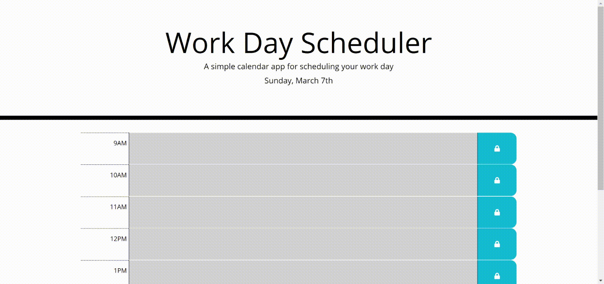

# 3-1-21-Homework
# 05 Third-Party APIs: Work Day Scheduler

This application is a simple planner that displays the current date and allows the user to input events per hour of the business day. Events can be saved to local storage for future viewing.

The planner can be found [here](https://elisesamanthadaly.github.io/3-1-21-Homework/).

## Usage

The current day of week and date can be seen on the third line of the header.

The present hour is highlighted in red. Past hours are highlighted in grey, and future ones in green.

If the user clicks an individual hour block, they can write an event. To save the event text, click the blue save button adjacent to that event block.

The planner automatically refreshes itself every 5 minutes. This updates the timeblock highlighting, but will delete unsaved event entries.

## Credits

Starter code (HTML, CSS) provided by UNC Coding Bootcamp.

And where would any of us be without [w3schools...](https://www.w3schools.com/)

## License

MIT License

Copyright (c) 2021 Elise Daly

Permission is hereby granted, free of charge, to any person obtaining a copy
of this software and associated documentation files (the "Software"), to deal
in the Software without restriction, including without limitation the rights
to use, copy, modify, merge, publish, distribute, sublicense, and/or sell
copies of the Software, and to permit persons to whom the Software is
furnished to do so, subject to the following conditions:

The above copyright notice and this permission notice shall be included in all
copies or substantial portions of the Software.

THE SOFTWARE IS PROVIDED "AS IS", WITHOUT WARRANTY OF ANY KIND, EXPRESS OR
IMPLIED, INCLUDING BUT NOT LIMITED TO THE WARRANTIES OF MERCHANTABILITY,
FITNESS FOR A PARTICULAR PURPOSE AND NONINFRINGEMENT. IN NO EVENT SHALL THE
AUTHORS OR COPYRIGHT HOLDERS BE LIABLE FOR ANY CLAIM, DAMAGES OR OTHER
LIABILITY, WHETHER IN AN ACTION OF CONTRACT, TORT OR OTHERWISE, ARISING FROM,
OUT OF OR IN CONNECTION WITH THE SOFTWARE OR THE USE OR OTHER DEALINGS IN THE
SOFTWARE.